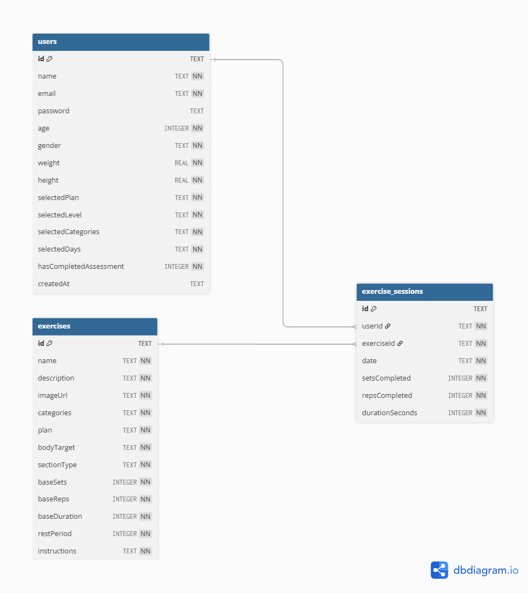
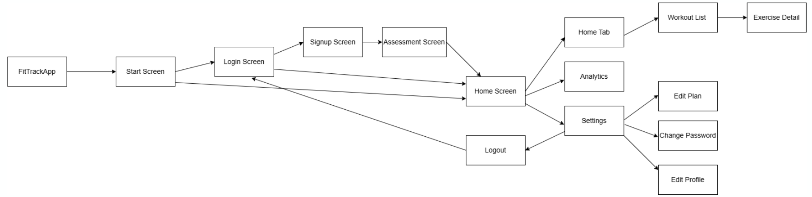

# FitTrack

A personalized workout tracking app built with Flutter for gym and home fitness enthusiasts.

## Features

- **Personalized Workouts** - Get customized workout plans based on your fitness level and goals
- **Exercise Library** - 80+ exercises with detailed instructions for both home and gym
- **Progress Tracking** - Track your workout history and see your progress over time
- **Analytics Dashboard** - Visualize your exercise data with charts and statistics
- **User Assessment** - Initial fitness assessment to tailor workouts to your needs
- **Multiple Workout Types** - Warm-up, main workout, cardio, and cool-down sections
- **Offline Support** - Local SQLite database for offline access

## Screenshots

<p align="center">
  
  
  
  
</p>
<p align="center">
  
  
</p>

## Diagrams

### Class Diagram
<p align="center">
  
</p>

### Database Diagram
<p align="center">
  
</p>

### Screen Diagram
<p align="center">
  
</p>

## Getting Started

### Prerequisites

- Flutter SDK 3.9.0 or higher
- Dart SDK 3.9.0 or higher
- Android Studio / VS Code with Flutter extensions

### Installation

1. **Clone the repository**
   ```bash
   git clone https://github.com/yourusername/fittrack.git
   cd fittrack
   ```

2. **Install dependencies**
   ```bash
   flutter pub get
   ```

3. **Run the app**
   ```bash
   flutter run
   ```
