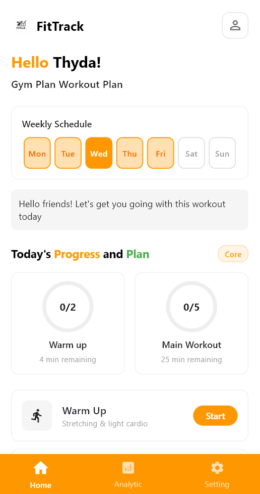
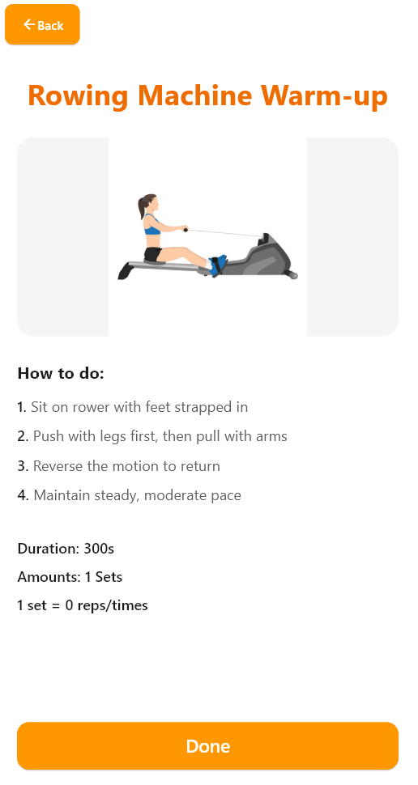
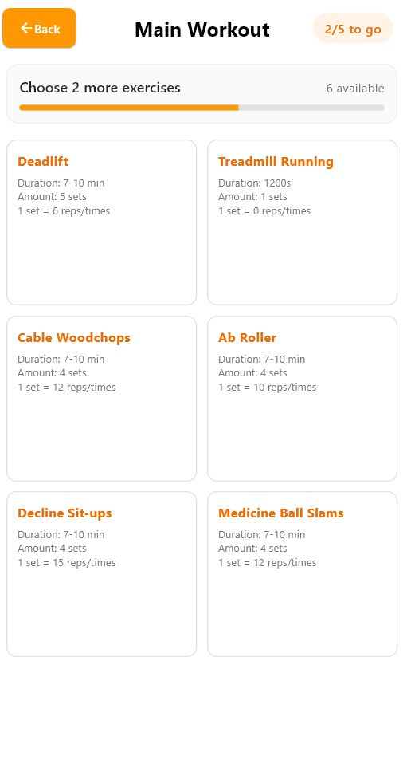
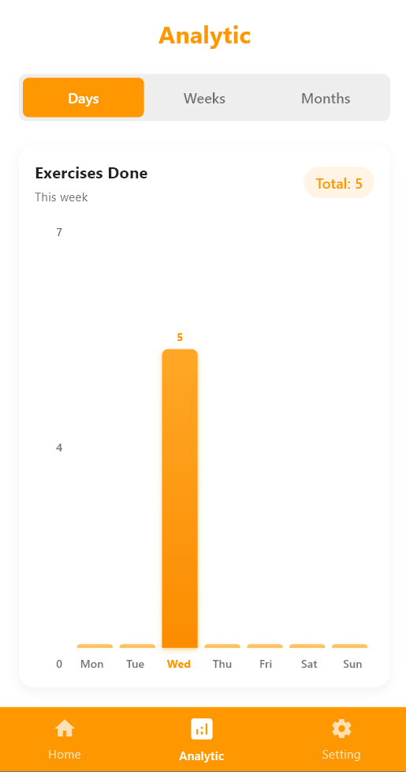
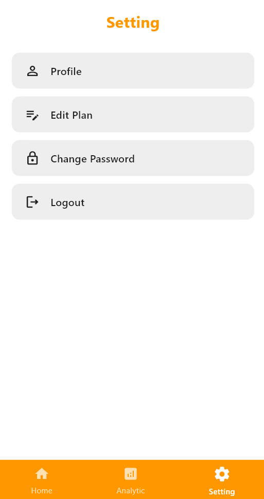
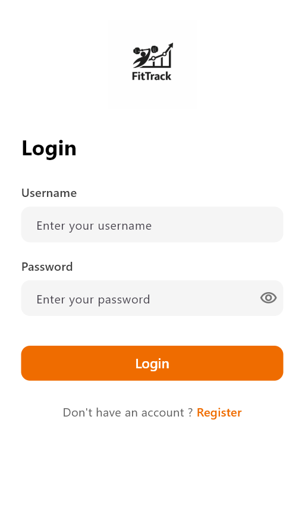
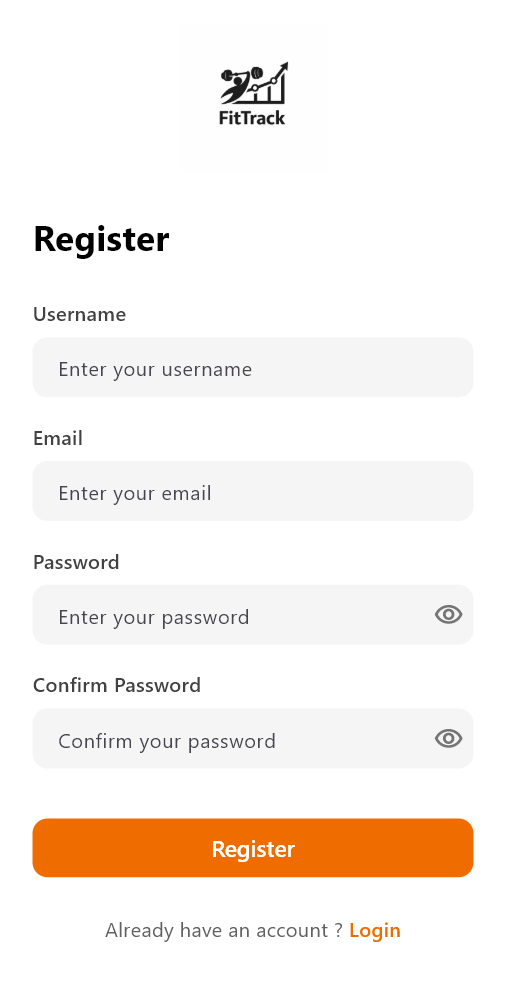

s# FitTrack 💪

A personalized workout tracking app built with Flutter for gym and home fitness enthusiasts.

## Features

- **Personalized Workouts** - Get customized workout plans based on your fitness level and goals
- **Exercise Library** - 80+ exercises with detailed instructions for both home and gym
- **Progress Tracking** - Track your workout history and see your progress over time
- **Analytics Dashboard** - Visualize your exercise data with charts and statistics
- **User Assessment** - Initial fitness assessment to tailor workouts to your needs
- **Multiple Workout Types** - Warm-up, main workout, cardio, and cool-down sections
- **Offline Support** - Local SQLite database for offline access

## Screenshots

<p align="center">
  
  
  
  
</p>
<p align="center">
  
  
  
</p>

## Tech Stack

- **Framework**: Flutter 3.9+
- **Language**: Dart
- **Database**: SQLite (sqflite)
- **State Management**: StatefulWidget
- **Local Storage**: SharedPreferences

## Project Structure

```
lib/
├── main.dart                 # App entry point
├── core/
│   ├── constants/            # Enums and app constants
│   ├── models/               # Data models (User, Exercise, etc.)
│   └── utils/                # Utility classes (Validators)
├── data/
│   ├── database/             # SQLite database helper & seeders
│   └── repositories/         # Data repositories
├── services/                 # Business logic services
│   ├── auth_service.dart     # Authentication
│   ├── user_service.dart     # User management
│   ├── workout_service.dart  # Workout operations
│   └── analytics_service.dart# Analytics & statistics
└── ui/
    ├── pages/                # App screens
    ├── widgets/              # Reusable widgets
    └── utils/                # UI utilities (responsive, snackbar)
```

## Getting Started

### Prerequisites

- Flutter SDK 3.9.0 or higher
- Dart SDK 3.9.0 or higher
- Android Studio / VS Code with Flutter extensions

### Installation

1. **Clone the repository**
   ```bash
   git clone https://github.com/yourusername/fittrack.git
   cd fittrack
   ```

2. **Install dependencies**
   ```bash
   flutter pub get
   ```

3. **Run the app**
   ```bash
   flutter run
   ```

### Running Tests

```bash
# Run all tests
flutter test

# Run specific test file
flutter test test/core/utils/validators_test.dart

# Run tests with coverage
flutter test --coverage
```

## Exercise Categories

| Category | Home | Gym |
|----------|------|-----|
| Warm-up | ✅ | ✅ |
| Strength | ✅ | ✅ |
| Cardio | ✅ | ✅ |
| Core | ✅ | ✅ |
| Cool-down | ✅ | ✅ |

## Body Targets

- Full Body
- Upper Body
- Lower Body
- Core

## Contributing

1. Fork the repository
2. Create your feature branch (`git checkout -b feature/amazing-feature`)
3. Commit your changes (`git commit -m 'Add some amazing feature'`)
4. Push to the branch (`git push origin feature/amazing-feature`)
5. Open a Pull Request

## License

This project is licensed under the MIT License - see the [LICENSE](LICENSE) file for details.

## Acknowledgments

- Flutter team for the amazing framework
- All contributors who helped build this app
